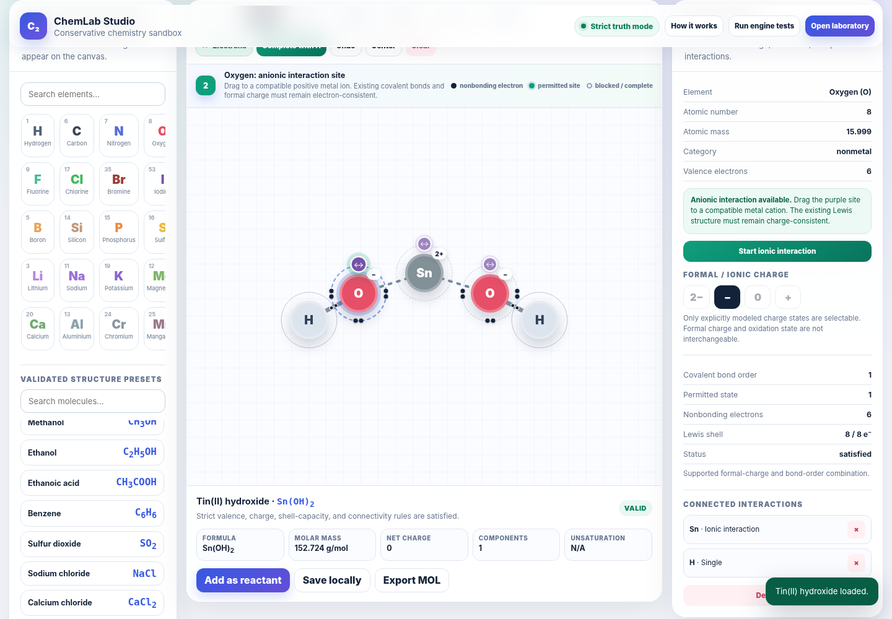

# ChemLab Studio

ChemLab Studio is an interactive chemistry learning lab where students can place atoms, see valence electrons, create bonds, validate structures, and explore reactions visually.

I built it around one rule: when the app cannot justify a structure, it should not pretend that the structure is valid.



## What it includes

- visual atom and molecule builder
- visible valence electrons and available bonding sites
- single, double, triple, aromatic, and ionic interaction modes
- click-to-bond and drag-to-bond interactions
- formal-charge, octet, shell-capacity, and valence validation
- molecule recognition using element, connectivity, bond order, and charge
- molecular formula, molar mass, net charge, and degree-of-unsaturation calculations
- MOL V2000 export
- equation balancing using exact rational arithmetic
- conservative deterministic reaction rules for common general-chemistry families
- local molecule saving in the browser
- responsive desktop and mobile layouts
- no backend, account, package installation, or external runtime dependency

## Run locally

```bash
git clone https://github.com/SyedAkramaIrshad/chemlab-studio.git
cd chemlab-studio
```

Open `index.html` in a browser.

## Validation results

The final engine was checked against the first 1,000 structures in RDKit's bundled NCI sample dataset using RDKit 2025.09.4.

- 1,000 structures processed without crashes
- 986 certified as valid by the implemented model
- 3 classified as open, radical, incomplete, or disconnected
- 11 classified as outside the current model
- 0 reference structures falsely labelled invalid
- 1,000/1,000 formulas parsed correctly
- 1,000/1,000 net charges matched
- 1,000/1,000 molar masses matched within 0.05 g/mol
- 1,000/1,000 MOL exports parsed back successfully with RDKit
- 1,000/1,000 deliberately invalid controls rejected
- 18/18 embedded engine tests passed
- 20/20 browser interaction tests passed

The complete results are available in [`audit/`](audit/).

## Meaning of each verdict

- **Valid** means the implemented Lewis, valence, charge, and connectivity rules can certify the structure.
- **Open** means the structure is radical, electron-deficient, incomplete, disconnected, or not a closed-shell molecule.
- **Unsupported** means the compound may be real, but the current model cannot make a reliable valid/invalid claim.
- **Invalid** means the structure violates a definite bonding, charge, shell, valence, or graph rule.

## Chemistry boundaries

This is a conservative educational chemistry engine, not a universal reaction oracle.

It does not guess advanced coordination compounds, organometallic systems, intermetallic solids, crystal lattices, stereochemical outcomes, quantum states, or reactions whose products depend on missing conditions such as solvent, temperature, pressure, concentration, catalyst, phase, or kinetics.

When a result is not uniquely supported, the app reports that limitation instead of inventing chemistry.

## Project structure

```text
index.html                         complete self-contained application
docs/preview-desktop.png           desktop preview
docs/preview-mobile.png            mobile preview
audit/1000_CHEMICAL_AUDIT.html     searchable audit report
audit/1000_CHEMICAL_AUDIT.csv      raw 1,000-structure results
audit/AUDIT_SUMMARY.txt            compact audit summary
audit/TEST_RESULTS.txt              engine and browser test results
```
